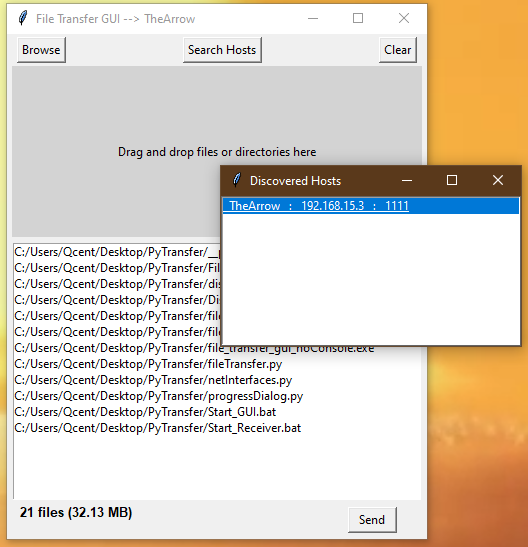
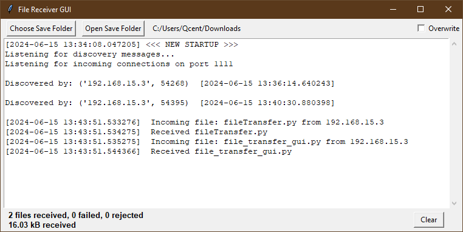

# NetworkFileCopyNinja

NetworkFileCopyNinja is a Python-based tool designed to simplify file transfer between hosts (Windows, macOS, Linux) on a network when traditional methods such as Windows networking, FTP, or other protocols fail to deliver. The project includes a suite of tools with graphical user interfaces (GUIs) to facilitate seamless file sharing across different operating systems.

## Table of Contents

- [Features](#features)
- [Requirements](#requirements)
- [Installation](#installation)
- [Usage](#usage)
  - [Tool 1: Command-Line File Sender and Receiver](#tool-1-command-line-file-sender-and-receiver)
  - [Tool 2: File Transfer GUI](#tool-2-file-transfer-gui)
  - [Tool 3: File Receiver GUI](#tool-3-file-receiver-gui)
- [Screenshots](#screenshots)
- [Contributing](#contributing)
- [License](#license)

### Features

1. **Cross-Platform File Transfer**: Simplify file transfer between Windows, macOS, and Linux systems on a network.
   
2. **Robust Transfer Mechanism**: Uses a reliable socket-based transfer when traditional protocols like SMB, FTP, or others fail to deliver.

3. **Tool 1: Command-line Interface (CLI)**
   - Allows sending files or directories via command-line arguments.
   - Discover network hosts via command-line arguments.
   - Supports specifying host IP, port, and file/directory paths directly from the terminal.

4. **Tool 2: File Transfer GUI**
   - Interactive graphical user interface (GUI) built with Tkinter.
   - Enables browsing files/directories, drag-and-drop functionality, and sending selected items to discovered network hosts.
   - Displays transfer status, including successful transfers and any failed attempts.
   - Integrates logging functionality to log received file information and events (`send.log`).

5. **Tool 3: File Receiver GUI**
   - GUI for receiving files over a network connection.
   - Allows users to select a save directory, toggle overwrite settings, and view received file statistics in real-time.
   - Integrates logging functionality to log received file information and events (`receiver.log`).

6. **Dynamic Host Discovery**
   - Automatically discovers and lists available network hosts.
   - Allows users to select hosts from a list for seamless file transfer.

## Requirements

- Python 3.x
- Required dependencies listed in `requirements.txt`
- Dependency modules include:
   - `tkinter` Python's standard GUI toolkit.
   - `tkinterdnd2` For drag-and-drop functionality
   - `netifaces` or `netifaces-plus` Assists network host discovery

## Installation

To get started with NetworkFileCopyNinja, clone the repository and install the required dependencies.

```bash
git clone https://github.com/yourusername/NetworkFileCopyNinja.git
cd NetworkFileCopyNinja
pip install -r requirements.txt
```

## Usage

### Tool 1: Command-line File Sender and Receiver

The File Sender and Receiver tool allows you to send and receive files or directories over a network.

#### Usage

1. **Sending Files/Directories:**

    To send files or directories, use the `send` mode. You need to specify the host and port to connect to. You can either send individual files or an entire directory.

    ```bash
    python file_transfer.py send --files file1.txt file2.txt --host <receiver_host> --port <port>
    ```

    Or to send a directory:

    ```bash
    python file_transfer.py send --dir /path/to/directory --host <receiver_host> --port <port>
    ```

    Example:

    ```bash
    python file_transfer.py send --dir /home/user/documents --host 192.168.1.2 --port 5001
    ```

2. **Receiving Files:**

    To receive files, use the `receive` mode. You need to specify the port to listen on and the directory to save the received files. Specifying the 'overwrite' flag will enable overwriting files

    ```bash
    python file_transfer.py receive --savedir /path/to/save --port <port> [--overwrite]
    ```

    Example:

    ```bash
    python file_transfer.py receive --savedir /home/user/downloads --port 5001 --overwrite
    ```

2. **Discovering Hosts:**

   To discover network hosts, use the discoverHosts.py tool. This will return a list of hosts with machine name, ip and port.

    ```bash
    python discoverHosts.py
    ```
   
### Tool 2: File Transfer GUI

The File Transfer GUI provides a graphical interface for sending files or directories over a network.

#### Usage

1. **Launching the GUI:**

   (Optional) When launching the GUI, you can specify the host and port to connect to. By default, the host will be set to 127.0.0.1 and the default port: 1111

    ```bash
    python file_transfer_gui.py --host <receiver_host> --port <port>
    ```

    Example:

    ```bash
    python file_transfer_gui.py --host 192.168.1.2 --port 5001
    ```

    

2. **Discovering Hosts:**

    - Click the **Search Hosts** button located within the GUI.
    - A popup window will appear listing discovered hosts on the network.
    - Double-click on a host to select it for file transfer.

3. **Using the GUI:**

    - **Browse Files:** Click the "Browse" button to select files or directories to send.
    - **Drag and Drop:** Drag and drop files or directories into the specified area.
    - **Clear Files:** Click the "Clear" button to remove all selected files from the list.
    - **Send Files:** Click the "Send" button to transfer the selected files or directories to the specified host and port.

### Tool 3: File Receiver GUI

The File Receiver GUI (`file_receiver_gui.py`) allows users to receive files over a network connection. It provides a graphical interface to manage file reception settings, view received file statistics, and interact with the received file log.

#### Usage

1. **Launching the GUI:**

   (Optional) When launching the GUI you can specify a save location, a port to listen on and file overwrite behaviour. If no parameters are supplied, the systems default download folder will be used, port 1111 will be selected and overwrite will not be enabled.
    ```bash
    python file_receiver_gui.py --savedir <save_directory> --port <port> [--overwrite]
    ```

    Example:

    ```bash
    python file_receiver_gui.py --savedir /home/user/downloads --port 5001 --overwrite
    ```

    

2. **Choosing Save Directory:**

    - Click the "Choose Save Folder" button to select the directory where received files will be saved.

3. **Overwrite Option:**

    - Toggle the "Overwrite" checkbox to enable/disable overwriting existing files during file reception.

4. **Viewing File Statistics:**

    - Real-time updates on received files, failed files, rejected files, and total data received are displayed in the GUI.

## Contributing

We welcome contributions to improve NetworkFileCopyNinja! Please fork the repository and submit a pull request with your changes.

## License

This project is licensed under the MIT License. See the [LICENSE](LICENSE) file for details.

